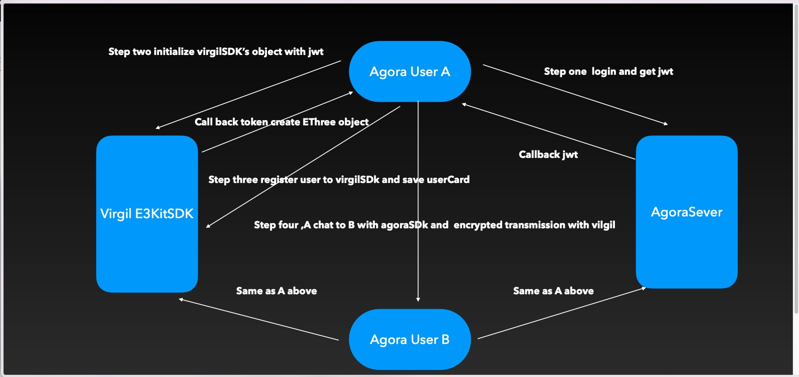

# What’s end-to-end encryption?

## Quote

> [Virgil Security document](https://developer.virgilsecurity.com/docs/e3kit/fundamentals/cryptography/)

> [Virgil Security github](https://github.com/VirgilSecurity)


An encrypted session means that only users on both sides of the chat can see the specific content of the current message after decrypting it with their respective secret keys after receiving the message. It protects the privacy of user chat contents well.

## If you don't want the content of your message to be known to anyone other than yourself and the other party, you may want to encrypt the content of the message before sending it in this way

# How to build end-to-end encrypted chat with AgoraChatSDK and Virgil

## Introduction

The AgoraChatEThreeExample will show you how to apply Virgil’s E3Kit group encryption to your  application’s chat messages using AgoraChatSDK.

Contains functions related to registration, login and logout and session list encryption session.

The E3EncryptoManager class is used to interact with e3kit and managed the currentuser information.

The interaction process is sample code



## How to implement encrypted sessions

### We use the group encryption function of VirgilE3Kit to ensure that users can see the historical messages in the local database.

1. Login and generate the jwt(jwt is a token that generated with virgilE3Kit sever SDK)

    1.1 We use agora's account login and then use the agoraToken. 
    
    1.2 Request authToken with the username of the current user.
    
    1.3 Request jwt from sever according to authToken and current username which will be used to initialize the VirgilE3KitSDK object(EThree).

2. Register user

    Use EThree object to register the current user with VirgilE3Kit.
    
    sample code
    
    ```Swift
    
        E3EncryptoManager.shared.createEThree(token,userName.lowercased())
        
        E3EncryptoManager.shared.e3?.register { error in
            self.handleRegister(userName, error)
        }
            
    ```
    

3. Get user's card and save

    Get the current user's Card object.
    
    sample code
    
    ```Swift
    
        do {
            try E3EncryptoManager.shared.card = E3EncryptoManager.shared.e3?.findUser(with: userName.lowercased()).startSync(timeout: 3).get()
        } catch {
            assert(false,"\(error.localizedDescription)")
        }
            
    ```

4. Create or load Virgil's group

    Then after everything is ready, we start to enter the function list page, click the E3EncryptChats option, enter the session list, in the upper right corner you can create a session with the user IDs of both parties (Note: The generated rules here are the user IDs of both parties and AgoraChat after splicing The string generated by sorting a character array,If it is a group conversation, Agora's conversationId can be used directly). 
    
    sample code
    
    ```Swift
    
            var groupId = E3EncryptoManager.shared.e3!.identity + item.conversationId! + "AgoraChat"
            groupId = String(groupId.lowercased().sorted())
            
    ```
    
    The creator can create VirgilE3Kit's group based on this id and the user id of the other party. 
    
    sample code
    
    ```Swift
    
            var cards: FindUsersResult?
            var group: Group?
            do {
                cards = try E3EncryptoManager.shared.e3?.findUsers(with: [self.toChatId.lowercased()]).startSync(timeout: 5).get()
                var groupId = E3EncryptoManager.shared.e3!.identity + self.toChatId + "AgoraChat"
                /*
                    Note that the creator is saved in the ext of AgoraChatConversation to know who the creator is the next time it is loaded from the database. When receiving a message from the other party, AgoraSDK will create an AgoraChatConversation at the bottom layer. If the ext of AgoraChatConversation is empty, AgoraChatConversation's id is used as the creator.
                */
                item.ext = ["e3GroupInitiator":E3EncryptoManager.shared.e3!.identity.lowercased()]
                groupId = groupId.lowercased()
                groupId = String(groupId.sorted())
                group = try E3EncryptoManager.shared.e3?.createGroup(id: groupId, with: cards!).startSync(timeout: 5).get()
                E3EncryptoManager.shared.e3GroupMap[groupId.lowercased()] = group
            } catch {
                ProgressHUD.showError("createChat:\(error.localizedDescription)")
            }
            
    ```
    
    After receiving the message, the other party can load it according to the creator and the group id of the same rules group
    
    sample code
    
    ```Swift
    
        func messagesDidReceive(_ aMessages: [Any]!) {
            guard let datas = AgoraChatClient.shared().chatManager.getAllConversations() as? [AgoraChatConversation] else { return }
            self.loadGroup(datas)
            self.conversations.removeAll()
            self.conversations = datas
            self.conversationList.reloadData()
        }
        
        private func loadGroup(_ datas: [AgoraChatConversation]) {
            for item in datas {
                var groupId = E3EncryptoManager.shared.e3!.identity + item.conversationId! + "AgoraChat"
                groupId = String(groupId.lowercased().sorted())
                if E3EncryptoManager.shared.e3GroupMap[groupId] != nil {
                break
            }
            var group: Group?
            var cards: FindUsersResult?
            do {
                if let ext = item.ext,!ext.isEmpty,let initiator = ext["e3GroupInitiator"] as? String,!initiator.isEmpty {
                    cards = try E3EncryptoManager.shared.e3?.findUsers(with: [initiator]).startSync(timeout: 3).get()
                } else {
                    item.ext = ["e3GroupInitiator":item.conversationId.lowercased()]
                    cards = try E3EncryptoManager.shared.e3?.findUsers(with: [item.conversationId.lowercased()]).startSync(timeout: 3).get()
                }
            } catch {
                ProgressHUD.showError("receive message find user error:\(error.localizedDescription)")
            }
            do {
                group = try E3EncryptoManager.shared.e3?.loadGroup(id: groupId, initiator: cards!.first!.value).startSync(timeout: 5).get()
                E3EncryptoManager.shared.e3GroupMap[groupId] = group
            } catch {
                ProgressHUD.showError("load group error:\(error.localizedDescription)")
            }
            cards?.forEach({
                E3EncryptoManager.shared.cards![$0] = $1
            })
        }
    }
            
    ```
5. Encrypt and decrypt messages

    Use the encryption and decryption method of the VirgilE3Kit's group to encrypt and decrypt the content of the sent message.
    
    sample code
    
    ```Swift
        //MARK: - Encrypt text
        text = self.group?.encrypt(text: text)
        let message = AgoraChatMessage(conversationID: self.title!, from: AgoraChatClient.shared().currentUsername!, to: self.title!, body: AgoraChatTextMessageBody(text: text), ext: [:])
        AgoraChatClient.shared().chatManager.send(message, progress: nil) { sendMessage, error in
            if let msg = sendMessage,error == nil {
                self.loadMessagerCard([msg])
                self.messagesList.reloadData()
            }
        }
        //MARK: - decrypt text
        content = try self.group?.decrypt(text: body.text, from: (E3EncryptoManager.shared.cards?[message.from])!, date: DateUtils.dateFromMilliTimestamp(message.timestamp)) ?? "decrypt error"
            
    ```
    If it is a picture, encrypt the binary data of the picture.
    
    sample code
    
    ```Swift
    
        let message = AgoraChatMessage(conversationID: self.title!, from: AgoraChatClient.shared().currentUsername!, to: self.title!, body: AgoraChatImageMessageBody(data: <#T##Data?#>, displayName: <#T##String?#>), ext: [:])
        AgoraChatClient.shared().chatManager.send(message, progress: nil) { sendMessage, error in
            if let msg = sendMessage,error == nil {
                self.loadMessagerCard([msg])
                self.messagesList.reloadData()
            }
        }            
    ```
    
    If it is audio, video or file, make a map encrypted file path in the local sandbox and then pass it into the file path of AgoraChatMessage.
    
    sample code
            
    ```Swift
    
        let message = AgoraChatMessage(conversationID: self.title!, from: AgoraChatClient.shared().currentUsername!, to: self.title!, body: AgoraChatFileMessageBody(localPath: "", displayName: ""), ext: [:])
        AgoraChatClient.shared().chatManager.send(message, progress: nil) { sendMessage, error in
            if let msg = sendMessage,error == nil {
                self.loadMessagerCard([msg])
                self.messagesList.reloadData()
            }
        }
            
    ```


## Using

After downloading the code, enter the AgoraChatEThreeExample folder in the terminal, and pod install

## If you have any questions, feel free to commit an issue


